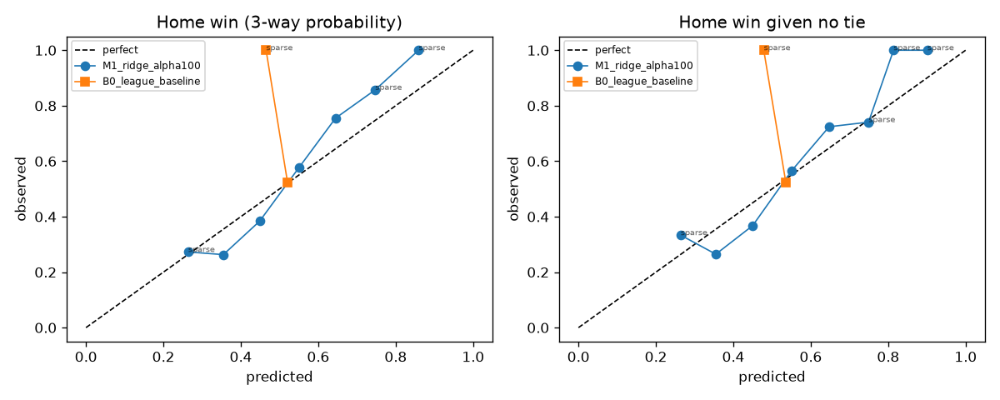
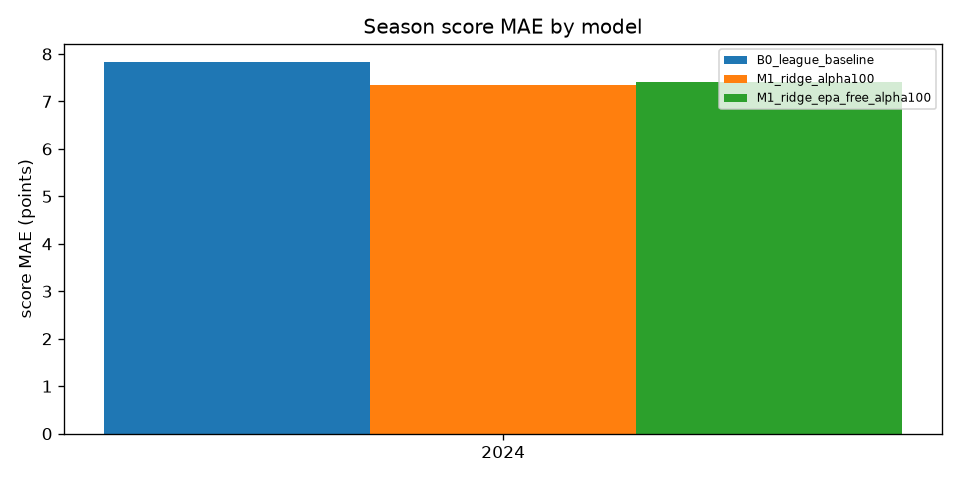
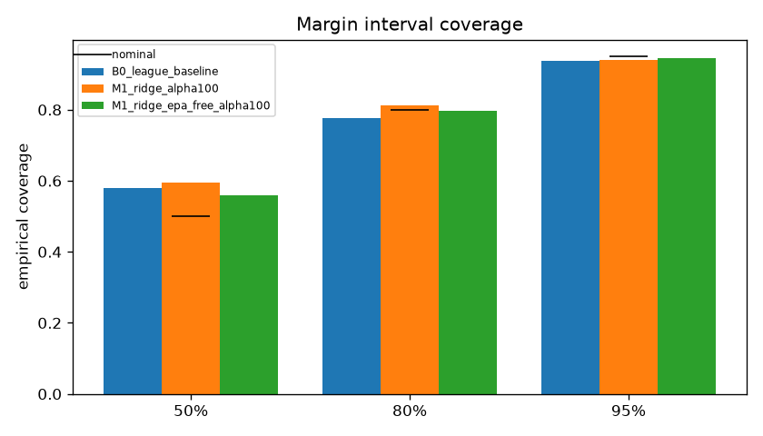
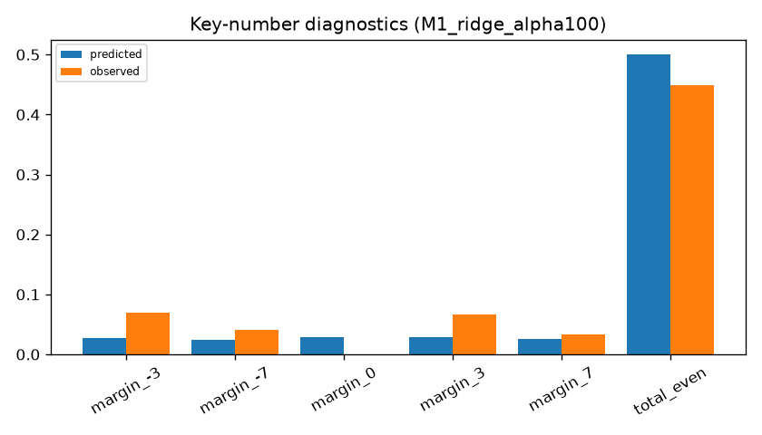
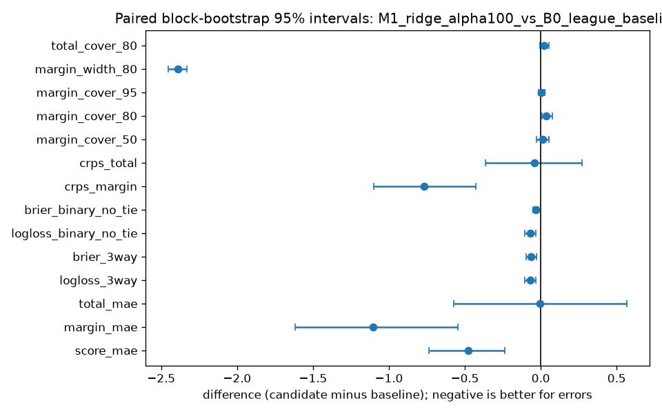

# NFL Origination Model — confirmation run `confirmation-20260916T173933Z-48f95d`

Created 2026-09-16T17:39:37.421544Z · data mode `historical_reconstruction` · forecast policy `kickoff_minus_24h` · git `518434a9d3a2e56d284c8a8bc701b181e3da819d` (dirty) · config hash `b8eb3c94eb33`

Scored seasons: [2024] · primary model `M1_ridge_alpha100` · baseline `B0_league_baseline`

## Methodology

Expanding chronological fits (train on 2012…Y−1, freeze for season Y), residual mean/covariance from the five most recent out-of-fold seasons, rounded bivariate-normal score PMF, fair prices from the PMF. Each game's cutoff is kickoff minus 24 hours; source games need kickoff + 48h ≤ cutoff.

## Samples and exclusions

| season | scheduled | expected | final | with PBP | excluded | complete |
|---|---|---|---|---|---|---|
| 2010 | 256 | 256 | 256 | 256 | 0 | True |
| 2011 | 256 | 256 | 256 | 256 | 0 | True |
| 2012 | 256 | 256 | 256 | 256 | 0 | True |
| 2013 | 256 | 256 | 256 | 256 | 0 | True |
| 2014 | 256 | 256 | 256 | 256 | 0 | True |
| 2015 | 256 | 256 | 256 | 256 | 0 | True |
| 2016 | 256 | 256 | 256 | 256 | 0 | True |
| 2017 | 256 | 256 | 256 | 256 | 0 | True |
| 2018 | 256 | 256 | 256 | 256 | 0 | True |
| 2019 | 256 | 256 | 256 | 256 | 0 | True |
| 2020 | 256 | 256 | 256 | 256 | 0 | True |
| 2021 | 272 | 272 | 272 | 272 | 0 | True |
| 2022 | 271 | 272 | 271 | 271 | 0 | False |
| 2023 | 272 | 272 | 272 | 272 | 0 | True |
| 2024 | 272 | 272 | 272 | 272 | 0 | True |
| 2025 | 272 | 272 | 272 | 272 | 0 | True |

Notes: season 2022: 271 scheduled games, expected 272

Exclusion rows: 0 (see exclusions.csv).

## Pooled metrics

| metric | B0_league_baseline | M1_ridge_alpha100 | M1_ridge_epa_free_alpha100 |
|---|---|---|---|
| Score MAE (team-game) | 7.8280 | 7.3521 | 7.4092 |
| Score RMSE | 9.7566 | 9.2307 | 9.2820 |
| Margin MAE | 11.1602 | 10.0563 | 10.1746 |
| Margin RMSE | 14.4698 | 13.1128 | 13.2139 |
| Total MAE | 10.0442 | 10.0375 | 10.0956 |
| Total RMSE | 13.0916 | 12.9954 | 13.0389 |
| 3-way log loss | 0.7213 | 0.6523 | 0.6596 |
| 3-way Brier (sum over classes) | 0.5010 | 0.4355 | 0.4417 |
| Binary log loss (non-tied) | 0.6930 | 0.6234 | 0.6304 |
| Binary Brier (non-tied) | 0.2499 | 0.2168 | 0.2199 |
| CRPS margin | 8.0876 | 7.3202 | 7.3970 |
| CRPS total | 7.2865 | 7.2435 | 7.2698 |
| Margin 50% coverage | 0.5809 | 0.5956 | 0.5588 |
| Margin 80% coverage | 0.7757 | 0.8125 | 0.7978 |
| Margin 95% coverage | 0.9375 | 0.9412 | 0.9449 |
| Margin 80% mean width | 36.0184 | 33.6287 | 33.6875 |
| Total 80% coverage | 0.8382 | 0.8603 | 0.8566 |
| Predicted tie rate | 0.0279 | 0.0285 | 0.0287 |
| Observed tie rate | 0.0000 | 0.0000 | 0.0000 |
| Games | 272.0000 | 272.0000 | 272.0000 |

## Paired differences vs baseline (block bootstrap 95% intervals)


**M1_ridge_alpha100_vs_B0_league_baseline**

| metric | candidate | baseline | difference | ci low | ci high | games |
|---|---|---|---|---|---|---|
| brier_3way | 0.4355 | 0.5010 | -0.0655 | -0.0970 | -0.0299 | 272 |
| brier_binary_no_tie | 0.2168 | 0.2499 | -0.0332 | -0.0493 | -0.0149 | 272 |
| crps_margin | 7.3202 | 8.0876 | -0.7674 | -1.1017 | -0.4266 | 272 |
| crps_total | 7.2435 | 7.2865 | -0.0431 | -0.3621 | 0.2713 | 272 |
| logloss_3way | 0.6523 | 0.7213 | -0.0690 | -0.1039 | -0.0304 | 272 |
| logloss_binary_no_tie | 0.6234 | 0.6930 | -0.0696 | -0.1044 | -0.0313 | 272 |
| margin_cover_50 | 0.5956 | 0.5809 | 0.0147 | -0.0296 | 0.0558 | 272 |
| margin_cover_80 | 0.8125 | 0.7757 | 0.0368 | 0.0070 | 0.0766 | 272 |
| margin_cover_95 | 0.9412 | 0.9375 | 0.0037 | -0.0150 | 0.0259 | 272 |
| margin_mae | 10.0563 | 11.1602 | -1.1040 | -1.6164 | -0.5445 | 272 |
| margin_width_80 | 33.6287 | 36.0184 | -2.3897 | -2.4529 | -2.3321 | 272 |
| score_mae | 7.3521 | 7.8280 | -0.4759 | -0.7357 | -0.2350 | 272 |
| total_cover_80 | 0.8603 | 0.8382 | 0.0221 | -0.0074 | 0.0534 | 272 |
| total_mae | 10.0375 | 10.0442 | -0.0067 | -0.5726 | 0.5660 | 272 |

**M1_ridge_epa_free_alpha100_vs_B0_league_baseline**

| metric | candidate | baseline | difference | ci low | ci high | games |
|---|---|---|---|---|---|---|
| brier_3way | 0.4417 | 0.5010 | -0.0593 | -0.0897 | -0.0236 | 272 |
| brier_binary_no_tie | 0.2199 | 0.2499 | -0.0301 | -0.0457 | -0.0117 | 272 |
| crps_margin | 7.3970 | 8.0876 | -0.6906 | -1.0025 | -0.3561 | 272 |
| crps_total | 7.2698 | 7.2865 | -0.0168 | -0.3340 | 0.3149 | 272 |
| logloss_3way | 0.6596 | 0.7213 | -0.0618 | -0.0945 | -0.0233 | 272 |
| logloss_binary_no_tie | 0.6304 | 0.6930 | -0.0626 | -0.0955 | -0.0243 | 272 |
| margin_cover_50 | 0.5588 | 0.5809 | -0.0221 | -0.0725 | 0.0224 | 272 |
| margin_cover_80 | 0.7978 | 0.7757 | 0.0221 | -0.0074 | 0.0568 | 272 |
| margin_cover_95 | 0.9449 | 0.9375 | 0.0074 | -0.0112 | 0.0292 | 272 |
| margin_mae | 10.1746 | 11.1602 | -0.9856 | -1.4801 | -0.4364 | 272 |
| margin_width_80 | 33.6875 | 36.0184 | -2.3309 | -2.3911 | -2.2744 | 272 |
| score_mae | 7.4092 | 7.8280 | -0.4188 | -0.6976 | -0.1704 | 272 |
| total_cover_80 | 0.8566 | 0.8382 | 0.0184 | -0.0187 | 0.0534 | 272 |
| total_mae | 10.0956 | 10.0442 | 0.0514 | -0.5080 | 0.6286 | 272 |

## Season and slice results (primary model)

| slice | games | score MAE | margin MAE | total MAE | 3-way log loss | CRPS margin | 80% cover |
|---|---|---|---|---|---|---|---|
| early_weeks_1_4 | 64.0000 | 7.1792 | 10.6439 | 9.2429 | 0.7342 | 7.7401 | 0.7656 |
| neutral_site | 5.0000 | 5.6881 | 9.6626 | 7.4234 | 0.7371 | 6.3449 | 1.0000 |
| season_2024 | 272.0000 | 7.3521 | 10.0563 | 10.0375 | 0.6523 | 7.3202 | 0.8125 |

## Reliability (primary model, 0.1 bins; sparse = fewer than 30 games)

| bin | n | mean predicted | observed | sparse |
|---|---|---|---|---|
| [0.0, 0.1) | 0 | n/a | n/a | True |
| [0.1, 0.2) | 0 | n/a | n/a | True |
| [0.2, 0.3) | 11 | 0.2639 | 0.2727 | True |
| [0.3, 0.4) | 38 | 0.3549 | 0.2632 | False |
| [0.4, 0.5) | 73 | 0.4485 | 0.3836 | False |
| [0.5, 0.6) | 71 | 0.5505 | 0.5775 | False |
| [0.6, 0.7) | 49 | 0.6446 | 0.7551 | False |
| [0.7, 0.8) | 28 | 0.7471 | 0.8571 | True |
| [0.8, 0.9) | 2 | 0.8593 | 1.0000 | True |
| [0.9, 1.0] | 0 | n/a | n/a | True |

## Key-number diagnostics (primary model)

| event | predicted | observed |
|---|---|---|
| margin_-3 | 0.0271 | 0.0699 |
| margin_-7 | 0.0239 | 0.0404 |
| margin_0 | 0.0285 | 0.0000 |
| margin_3 | 0.0282 | 0.0662 |
| margin_7 | 0.0262 | 0.0331 |
| total_even | 0.5001 | 0.4485 |

## Recommendation

M1_ridge_alpha100 improves on B0_league_baseline with bootstrap intervals excluding zero on score_mae, logloss_3way, crps_margin. Recommend the candidate as the V1 origination model, with the stated limitations. Further modeling is still needed before any real pregame use.

## Charts







## Market comparison and paper backtest

unavailable: no eligible timestamped odds

## Limitations

- Historical reconstruction uses current pinned nflverse files with a 48-hour eligibility convention; it is not a point-in-time-certified backtest. Upstream EPA values may have been revised or computed with models trained later (see the EPA-free ablation).
- No injuries, projected starters, weather, or depth charts are used. This limits real pregame usefulness and is disclosed rather than hidden.
- Scores come from a rounded, zero-floored bivariate normal. It permits implausible scores and smooths NFL key numbers (3, 7) and total parity; key-number diagnostics expose this.
- The 2025 holdout is a retrospective project holdout, not proof of no prior knowledge of its outcomes.
- Bookmaker lines are price references, not conditional means. A model-market gap is not proof of mispricing, and no positive ROI is claimed.

## Provenance

```json
{
 "run_id": "confirmation-20260916T173933Z-48f95d",
 "config_hash": "b8eb3c94eb3388ec3f3ff44dda35e9130178f1d32a5f2a459ddc134106dcbcb5",
 "source_file_hashes": {
  "pbp/2010": "d2ef9c407319719910ad8de8c4c1b88f0ea945ffb3f78f48ef32fa3ed3a7573b",
  "pbp/2011": "c54753b8137b88dab260489b1462cbf1309c3d11741eb8d10e5f1b0a9b8795b1",
  "pbp/2012": "447b90789104aac70427ec9d3b51df7247234029d0ecabd269279369b1cc6278",
  "pbp/2013": "f454605a1983b3946baf0ffadf3a0b9f5e04735c4b84732e0483f2049a780d00",
  "pbp/2014": "54c01408d8f0ff9e013a4ea51428b91d610101f72545d082e932f5710e2fb4f7",
  "pbp/2015": "01b5ae7d06633a2e66b418404461a3d4ff055ad2f3a87d453cebcc8d3fda7ed9",
  "pbp/2016": "95eba04e2145e3c1c8ca502f2a3a76cfb0a5990680c3fb480f02a74a45f54a3b",
  "pbp/2017": "84eacd963c1fdd45965f6222c62e9329a7f3412f029d92c1ac5e34a1bb4d3710",
  "pbp/2018": "2e6f2dce7c7ebd46e985cabe0c17eb72b39a77f98cb4478409294f50b5820150",
  "pbp/2019": "60c3067017db2d28a78f66a79b657268be8578d9a5288e6a827efdcd7fe42540",
  "pbp/2020": "8889f5d8782b5c5dce3c3644acdc0322b228a7e9cb13fa36cbac250e260e9f60",
  "pbp/2021": "333ad34378e5339d5172717cc83378e908daf02c8699416ab3e17c2ec10f78d8",
  "pbp/2022": "931121d8897779d7944e2a293e92ed8799c8e5cceef84096ac42339003fedc09",
  "pbp/2023": "bd3484731408def6b0ec93225bba2bd7b2c65769ca707a2b9444d891abdc6776",
  "pbp/2024": "3fd2896bc0b911b615142d2f1fabae54a4bbba5ab7b73b28187b118ef8af6a3b",
  "pbp/2025": "c6ecedd6d678cc37ed316b23ef84ee1ec6abb69c514bb11868a7ebd5a367df29",
  "schedules/all": "fa6684321ed9d08ee7496dfa9a4d345e9445cba7e8842c42f383ad524dc442d0"
 },
 "output_hashes": {
  "metrics.json": "380c4b7da61daa69f1242c86779078399e1882407e3dbb56a30b5e0d38765aff",
  "predictions.parquet": "a45f80d7e276723930c8a807546a8cd2cca04424028757c05a62218780f05dfc",
  "predictions_B0_league_baseline.parquet": "639a2f268601539b86f1896a84e5630445ed47f61090191ea4ef0c07ae364f83",
  "predictions_M1_ridge_alpha100.parquet": "a45f80d7e276723930c8a807546a8cd2cca04424028757c05a62218780f05dfc",
  "predictions_M1_ridge_epa_free_alpha100.parquet": "a6937661c0aa2d1338a47d64bd1a0dae667c3c319c006f2501e4b27dc5d6a7da"
 },
 "dependency_versions": {
  "duckdb": "1.5.5",
  "matplotlib": "3.11.2",
  "nfl_origination": "0.1.0",
  "numpy": "2.5.3",
  "pandas": "3.0.5",
  "pyarrow": "25.0.1",
  "pydantic": "2.13.5",
  "python": "3.12.14",
  "scikit-learn": "1.9.1",
  "scipy": "1.18.1",
  "streamlit": "1.64.0",
  "typer": "0.27.2"
 },
 "notes": []
}
```
