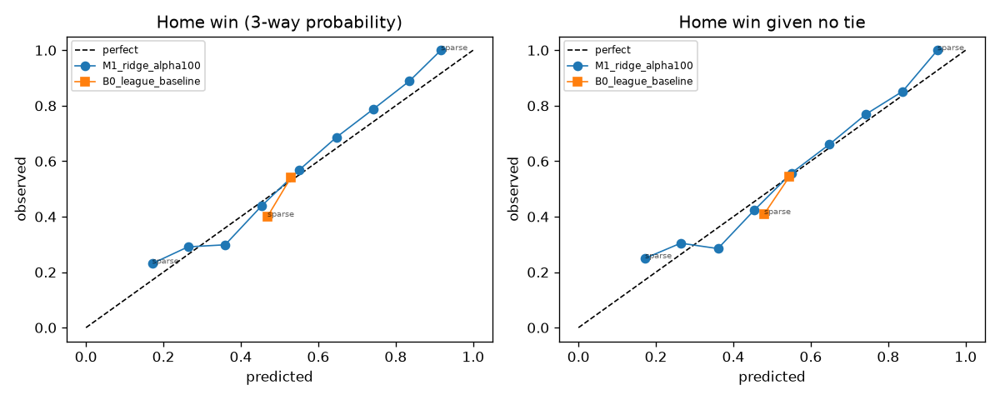
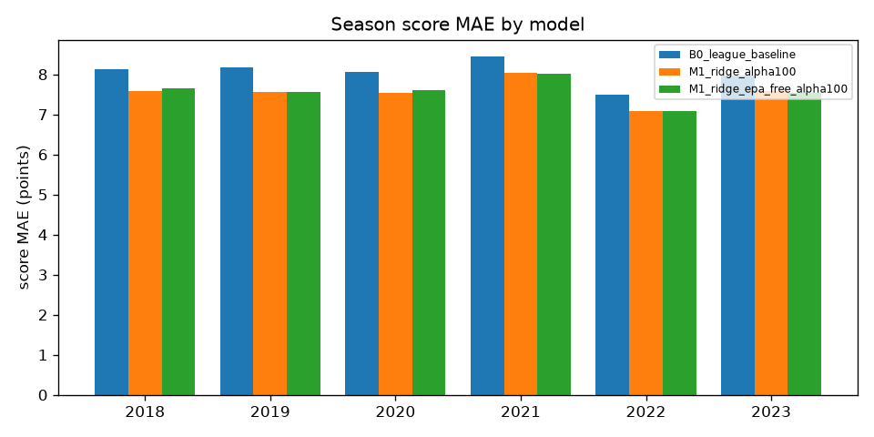
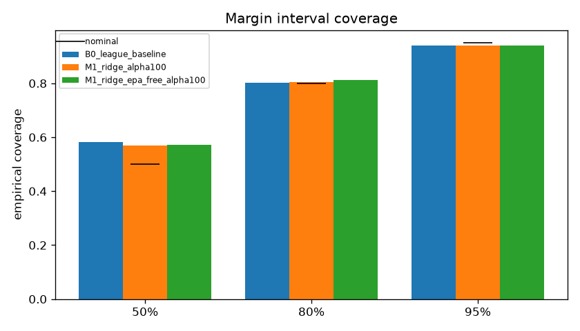
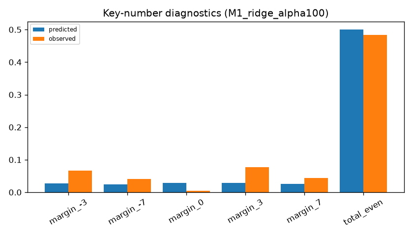
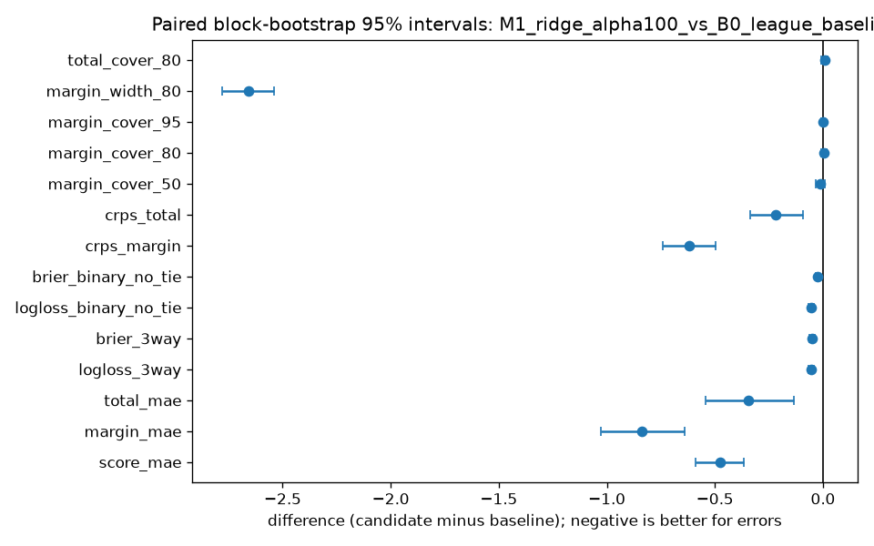

# NFL Origination Model — development run `development-20260916T173324Z-b71c52`

Created 2026-09-16T17:34:28.057045Z · data mode `historical_reconstruction` · forecast policy `kickoff_minus_24h` · git `518434a9d3a2e56d284c8a8bc701b181e3da819d` (dirty) · config hash `95b5265373cc`

Scored seasons: [2018, 2019, 2020, 2021, 2022, 2023] · primary model `M1_ridge_alpha100` · baseline `B0_league_baseline`

## Methodology

Expanding chronological fits (train on 2012…Y−1, freeze for season Y), residual mean/covariance from the five most recent out-of-fold seasons, rounded bivariate-normal score PMF, fair prices from the PMF. Each game's cutoff is kickoff minus 24 hours; source games need kickoff + 48h ≤ cutoff.

## Samples and exclusions

| season | scheduled | expected | final | with PBP | excluded | complete |
|---|---|---|---|---|---|---|
| 2010 | 256 | 256 | 256 | 256 | 0 | True |
| 2011 | 256 | 256 | 256 | 256 | 0 | True |
| 2012 | 256 | 256 | 256 | 256 | 0 | True |
| 2013 | 256 | 256 | 256 | 256 | 0 | True |
| 2014 | 256 | 256 | 256 | 256 | 0 | True |
| 2015 | 256 | 256 | 256 | 256 | 0 | True |
| 2016 | 256 | 256 | 256 | 256 | 0 | True |
| 2017 | 256 | 256 | 256 | 256 | 0 | True |
| 2018 | 256 | 256 | 256 | 256 | 0 | True |
| 2019 | 256 | 256 | 256 | 256 | 0 | True |
| 2020 | 256 | 256 | 256 | 256 | 0 | True |
| 2021 | 272 | 272 | 272 | 272 | 0 | True |
| 2022 | 271 | 272 | 271 | 271 | 0 | False |
| 2023 | 272 | 272 | 272 | 272 | 0 | True |
| 2024 | 272 | 272 | 272 | 272 | 0 | True |
| 2025 | 272 | 272 | 272 | 272 | 0 | True |

Notes: season 2022: 271 scheduled games, expected 272

Exclusion rows: 0 (see exclusions.csv).

## Pooled metrics

| metric | B0_league_baseline | M1_ridge_alpha100 | M1_ridge_epa_free_alpha100 |
|---|---|---|---|
| Score MAE (team-game) | 8.0411 | 7.5660 | 7.5772 |
| Score RMSE | 10.0696 | 9.5533 | 9.5473 |
| Margin MAE | 11.0559 | 10.2162 | 10.2321 |
| Margin RMSE | 14.3454 | 13.2494 | 13.2738 |
| Total MAE | 11.2610 | 10.9149 | 10.9064 |
| Total RMSE | 14.1348 | 13.7665 | 13.7262 |
| 3-way log loss | 0.7304 | 0.6770 | 0.6796 |
| 3-way Brier (sum over classes) | 0.5015 | 0.4508 | 0.4531 |
| Binary log loss (non-tied) | 0.6893 | 0.6355 | 0.6380 |
| Binary Brier (non-tied) | 0.2481 | 0.2224 | 0.2236 |
| CRPS margin | 8.0083 | 7.3912 | 7.4044 |
| CRPS total | 7.9464 | 7.7269 | 7.7108 |
| Margin 50% coverage | 0.5824 | 0.5704 | 0.5717 |
| Margin 80% coverage | 0.8016 | 0.8054 | 0.8130 |
| Margin 95% coverage | 0.9394 | 0.9400 | 0.9413 |
| Margin 80% mean width | 36.1819 | 33.5256 | 33.7258 |
| Total 80% coverage | 0.8111 | 0.8181 | 0.8206 |
| Predicted tie rate | 0.0280 | 0.0283 | 0.0284 |
| Observed tie rate | 0.0044 | 0.0044 | 0.0044 |
| Games | 1583.0000 | 1583.0000 | 1583.0000 |

## Paired differences vs baseline (block bootstrap 95% intervals)


**M1_ridge_alpha1000_vs_B0_league_baseline**

| metric | candidate | baseline | difference | ci low | ci high | games |
|---|---|---|---|---|---|---|
| brier_3way | 0.4529 | 0.5015 | -0.0485 | -0.0585 | -0.0384 | 1583 |
| brier_binary_no_tie | 0.2234 | 0.2481 | -0.0247 | -0.0297 | -0.0195 | 1583 |
| crps_margin | 7.4074 | 8.0083 | -0.6009 | -0.7118 | -0.4994 | 1583 |
| crps_total | 7.7204 | 7.9464 | -0.2260 | -0.3384 | -0.1097 | 1583 |
| logloss_3way | 0.6793 | 0.7304 | -0.0511 | -0.0620 | -0.0397 | 1583 |
| logloss_binary_no_tie | 0.6377 | 0.6893 | -0.0517 | -0.0624 | -0.0403 | 1583 |
| margin_cover_50 | 0.5717 | 0.5824 | -0.0107 | -0.0305 | 0.0087 | 1583 |
| margin_cover_80 | 0.8073 | 0.8016 | 0.0057 | -0.0070 | 0.0181 | 1583 |
| margin_cover_95 | 0.9413 | 0.9394 | 0.0019 | -0.0063 | 0.0113 | 1583 |
| margin_mae | 10.2304 | 11.0559 | -0.8255 | -0.9860 | -0.6415 | 1583 |
| margin_width_80 | 33.7511 | 36.1819 | -2.4308 | -2.5589 | -2.3040 | 1583 |
| score_mae | 7.5788 | 8.0411 | -0.4623 | -0.5636 | -0.3640 | 1583 |
| total_cover_80 | 0.8162 | 0.8111 | 0.0051 | -0.0082 | 0.0178 | 1583 |
| total_mae | 10.9092 | 11.2610 | -0.3519 | -0.5355 | -0.1475 | 1583 |

**M1_ridge_alpha100_vs_B0_league_baseline**

| metric | candidate | baseline | difference | ci low | ci high | games |
|---|---|---|---|---|---|---|
| brier_3way | 0.4508 | 0.5015 | -0.0507 | -0.0618 | -0.0390 | 1583 |
| brier_binary_no_tie | 0.2224 | 0.2481 | -0.0257 | -0.0315 | -0.0197 | 1583 |
| crps_margin | 7.3912 | 8.0083 | -0.6171 | -0.7418 | -0.4982 | 1583 |
| crps_total | 7.7269 | 7.9464 | -0.2195 | -0.3369 | -0.0936 | 1583 |
| logloss_3way | 0.6770 | 0.7304 | -0.0535 | -0.0662 | -0.0402 | 1583 |
| logloss_binary_no_tie | 0.6355 | 0.6893 | -0.0539 | -0.0667 | -0.0406 | 1583 |
| margin_cover_50 | 0.5704 | 0.5824 | -0.0120 | -0.0334 | 0.0082 | 1583 |
| margin_cover_80 | 0.8054 | 0.8016 | 0.0038 | -0.0095 | 0.0165 | 1583 |
| margin_cover_95 | 0.9400 | 0.9394 | 0.0006 | -0.0076 | 0.0095 | 1583 |
| margin_mae | 10.2162 | 11.0559 | -0.8396 | -1.0273 | -0.6390 | 1583 |
| margin_width_80 | 33.5256 | 36.1819 | -2.6563 | -2.7796 | -2.5388 | 1583 |
| score_mae | 7.5660 | 8.0411 | -0.4751 | -0.5887 | -0.3645 | 1583 |
| total_cover_80 | 0.8181 | 0.8111 | 0.0069 | -0.0076 | 0.0204 | 1583 |
| total_mae | 10.9149 | 11.2610 | -0.3462 | -0.5436 | -0.1342 | 1583 |

**M1_ridge_epa_free_alpha1000_vs_B0_league_baseline**

| metric | candidate | baseline | difference | ci low | ci high | games |
|---|---|---|---|---|---|---|
| brier_3way | 0.4595 | 0.5015 | -0.0419 | -0.0502 | -0.0335 | 1583 |
| brier_binary_no_tie | 0.2267 | 0.2481 | -0.0214 | -0.0256 | -0.0171 | 1583 |
| crps_margin | 7.4809 | 8.0083 | -0.5274 | -0.6148 | -0.4438 | 1583 |
| crps_total | 7.6892 | 7.9464 | -0.2572 | -0.3482 | -0.1556 | 1583 |
| logloss_3way | 0.6866 | 0.7304 | -0.0438 | -0.0528 | -0.0347 | 1583 |
| logloss_binary_no_tie | 0.6448 | 0.6893 | -0.0445 | -0.0536 | -0.0353 | 1583 |
| margin_cover_50 | 0.5742 | 0.5824 | -0.0082 | -0.0246 | 0.0094 | 1583 |
| margin_cover_80 | 0.8086 | 0.8016 | 0.0069 | -0.0038 | 0.0178 | 1583 |
| margin_cover_95 | 0.9394 | 0.9394 | 0.0000 | -0.0082 | 0.0088 | 1583 |
| margin_mae | 10.3316 | 11.0559 | -0.7243 | -0.8629 | -0.5753 | 1583 |
| margin_width_80 | 34.1541 | 36.1819 | -2.0278 | -2.1633 | -1.8973 | 1583 |
| score_mae | 7.6131 | 8.0411 | -0.4280 | -0.5077 | -0.3450 | 1583 |
| total_cover_80 | 0.8136 | 0.8111 | 0.0025 | -0.0094 | 0.0152 | 1583 |
| total_mae | 10.8721 | 11.2610 | -0.3890 | -0.5410 | -0.2249 | 1583 |

**M1_ridge_epa_free_alpha100_vs_B0_league_baseline**

| metric | candidate | baseline | difference | ci low | ci high | games |
|---|---|---|---|---|---|---|
| brier_3way | 0.4531 | 0.5015 | -0.0483 | -0.0589 | -0.0376 | 1583 |
| brier_binary_no_tie | 0.2236 | 0.2481 | -0.0245 | -0.0300 | -0.0191 | 1583 |
| crps_margin | 7.4044 | 8.0083 | -0.6039 | -0.7113 | -0.4981 | 1583 |
| crps_total | 7.7108 | 7.9464 | -0.2356 | -0.3552 | -0.1021 | 1583 |
| logloss_3way | 0.6796 | 0.7304 | -0.0508 | -0.0626 | -0.0389 | 1583 |
| logloss_binary_no_tie | 0.6380 | 0.6893 | -0.0514 | -0.0632 | -0.0395 | 1583 |
| margin_cover_50 | 0.5717 | 0.5824 | -0.0107 | -0.0305 | 0.0095 | 1583 |
| margin_cover_80 | 0.8130 | 0.8016 | 0.0114 | -0.0013 | 0.0240 | 1583 |
| margin_cover_95 | 0.9413 | 0.9394 | 0.0019 | -0.0076 | 0.0114 | 1583 |
| margin_mae | 10.2321 | 11.0559 | -0.8238 | -0.9988 | -0.6386 | 1583 |
| margin_width_80 | 33.7258 | 36.1819 | -2.4561 | -2.5839 | -2.3293 | 1583 |
| score_mae | 7.5772 | 8.0411 | -0.4639 | -0.5715 | -0.3580 | 1583 |
| total_cover_80 | 0.8206 | 0.8111 | 0.0095 | -0.0038 | 0.0221 | 1583 |
| total_mae | 10.9064 | 11.2610 | -0.3547 | -0.5523 | -0.1377 | 1583 |

## Season and slice results (primary model)

| slice | games | score MAE | margin MAE | total MAE | 3-way log loss | CRPS margin | 80% cover |
|---|---|---|---|---|---|---|---|
| early_weeks_1_4 | 381.0000 | 7.3885 | 9.8422 | 10.8758 | 0.7137 | 7.1852 | 0.8268 |
| neutral_site | 25.0000 | 5.8099 | 9.1127 | 8.0157 | 0.6677 | 6.8078 | 0.8400 |
| season_2018 | 256.0000 | 7.5853 | 10.0453 | 11.1256 | 0.6604 | 7.3373 | 0.8047 |
| season_2019 | 256.0000 | 7.5620 | 10.6199 | 10.8334 | 0.6792 | 7.6189 | 0.7891 |
| season_2020 | 256.0000 | 7.5397 | 10.2007 | 10.7176 | 0.6664 | 7.3192 | 0.8164 |
| season_2021 | 272.0000 | 8.0332 | 11.2053 | 11.4609 | 0.6872 | 7.9770 | 0.7794 |
| season_2022 | 271.0000 | 7.0872 | 8.8721 | 10.8886 | 0.6840 | 6.5171 | 0.8672 |
| season_2023 | 272.0000 | 7.5862 | 10.3619 | 10.4591 | 0.6831 | 7.5805 | 0.7757 |

## Reliability (primary model, 0.1 bins; sparse = fewer than 30 games)

| bin | n | mean predicted | observed | sparse |
|---|---|---|---|---|
| [0.0, 0.1) | 0 | n/a | n/a | True |
| [0.1, 0.2) | 13 | 0.1709 | 0.2308 | True |
| [0.2, 0.3) | 79 | 0.2635 | 0.2911 | False |
| [0.3, 0.4) | 211 | 0.3594 | 0.2986 | False |
| [0.4, 0.5) | 358 | 0.4535 | 0.4385 | False |
| [0.5, 0.6) | 405 | 0.5504 | 0.5679 | False |
| [0.6, 0.7) | 328 | 0.6468 | 0.6860 | False |
| [0.7, 0.8) | 151 | 0.7426 | 0.7881 | False |
| [0.8, 0.9) | 36 | 0.8355 | 0.8889 | False |
| [0.9, 1.0] | 2 | 0.9168 | 1.0000 | True |

## Key-number diagnostics (primary model)

| event | predicted | observed |
|---|---|---|
| margin_-3 | 0.0269 | 0.0670 |
| margin_-7 | 0.0235 | 0.0411 |
| margin_0 | 0.0283 | 0.0044 |
| margin_3 | 0.0282 | 0.0777 |
| margin_7 | 0.0264 | 0.0442 |
| total_even | 0.5001 | 0.4833 |

## Alpha decision record


Feature set `epa_free`: selected alpha **100.0** (min pooled game-level score MAE over development seasons; ties within 0.01 points resolved toward the larger alpha).

| alpha | pooled score MAE | games |
|---|---|---|
| 1.0000 | 7.5774 | 1583 |
| 10.0000 | 7.5773 | 1583 |
| 100.0000 | 7.5772 | 1583 |
| 1000.0000 | 7.6131 | 1583 |

Feature set `full`: selected alpha **100.0** (min pooled game-level score MAE over development seasons; ties within 0.01 points resolved toward the larger alpha).

| alpha | pooled score MAE | games |
|---|---|---|
| 1.0000 | 7.5664 | 1583 |
| 10.0000 | 7.5657 | 1583 |
| 100.0000 | 7.5660 | 1583 |
| 1000.0000 | 7.5788 | 1583 |

## Recommendation

M1_ridge_alpha100 improves on B0_league_baseline with bootstrap intervals excluding zero on score_mae, logloss_3way, crps_margin, crps_total. Recommend the candidate as the V1 origination model, with the stated limitations. Further modeling is still needed before any real pregame use.

## Charts







## Market comparison and paper backtest

unavailable: no eligible timestamped odds

## Limitations

- Historical reconstruction uses current pinned nflverse files with a 48-hour eligibility convention; it is not a point-in-time-certified backtest. Upstream EPA values may have been revised or computed with models trained later (see the EPA-free ablation).
- No injuries, projected starters, weather, or depth charts are used. This limits real pregame usefulness and is disclosed rather than hidden.
- Scores come from a rounded, zero-floored bivariate normal. It permits implausible scores and smooths NFL key numbers (3, 7) and total parity; key-number diagnostics expose this.
- The 2025 holdout is a retrospective project holdout, not proof of no prior knowledge of its outcomes.
- Bookmaker lines are price references, not conditional means. A model-market gap is not proof of mispricing, and no positive ROI is claimed.

## Provenance

```json
{
 "run_id": "development-20260916T173324Z-b71c52",
 "config_hash": "95b5265373ccc9aee3db410a297fa5f13e46692716d05ea30223f668cea20b26",
 "source_file_hashes": {
  "pbp/2010": "d2ef9c407319719910ad8de8c4c1b88f0ea945ffb3f78f48ef32fa3ed3a7573b",
  "pbp/2011": "c54753b8137b88dab260489b1462cbf1309c3d11741eb8d10e5f1b0a9b8795b1",
  "pbp/2012": "447b90789104aac70427ec9d3b51df7247234029d0ecabd269279369b1cc6278",
  "pbp/2013": "f454605a1983b3946baf0ffadf3a0b9f5e04735c4b84732e0483f2049a780d00",
  "pbp/2014": "54c01408d8f0ff9e013a4ea51428b91d610101f72545d082e932f5710e2fb4f7",
  "pbp/2015": "01b5ae7d06633a2e66b418404461a3d4ff055ad2f3a87d453cebcc8d3fda7ed9",
  "pbp/2016": "95eba04e2145e3c1c8ca502f2a3a76cfb0a5990680c3fb480f02a74a45f54a3b",
  "pbp/2017": "84eacd963c1fdd45965f6222c62e9329a7f3412f029d92c1ac5e34a1bb4d3710",
  "pbp/2018": "2e6f2dce7c7ebd46e985cabe0c17eb72b39a77f98cb4478409294f50b5820150",
  "pbp/2019": "60c3067017db2d28a78f66a79b657268be8578d9a5288e6a827efdcd7fe42540",
  "pbp/2020": "8889f5d8782b5c5dce3c3644acdc0322b228a7e9cb13fa36cbac250e260e9f60",
  "pbp/2021": "333ad34378e5339d5172717cc83378e908daf02c8699416ab3e17c2ec10f78d8",
  "pbp/2022": "931121d8897779d7944e2a293e92ed8799c8e5cceef84096ac42339003fedc09",
  "pbp/2023": "bd3484731408def6b0ec93225bba2bd7b2c65769ca707a2b9444d891abdc6776",
  "pbp/2024": "3fd2896bc0b911b615142d2f1fabae54a4bbba5ab7b73b28187b118ef8af6a3b",
  "pbp/2025": "c6ecedd6d678cc37ed316b23ef84ee1ec6abb69c514bb11868a7ebd5a367df29",
  "schedules/all": "fa6684321ed9d08ee7496dfa9a4d345e9445cba7e8842c42f383ad524dc442d0"
 },
 "output_hashes": {
  "metrics.json": "3e81c13aeedf0be15573376db09e1b21528f4ab6af86416efee041fa51245699",
  "predictions.parquet": "2ea9cebc1033a69db37205f9322c374d60a0a667bdc1d5a27db4aff3af534bcd",
  "predictions_B0_league_baseline.parquet": "e535e23b0658477745f6206bb6539ae97f28440fd4b525d5c71766ecddffe66f",
  "predictions_M1_ridge_alpha1.parquet": "7c79d73d271de12d5a82021b11d36415ecc391e912090bd2544e44dcc90bd315",
  "predictions_M1_ridge_alpha10.parquet": "d37d7fe28868f3cc971aec53ed88b67503297f8dc42d322460486587f5904fc7",
  "predictions_M1_ridge_alpha100.parquet": "2ea9cebc1033a69db37205f9322c374d60a0a667bdc1d5a27db4aff3af534bcd",
  "predictions_M1_ridge_alpha1000.parquet": "0ee1fe929d3c4d532e9840a743a54714943629478ed87a00b6e2fcb9241917d5",
  "predictions_M1_ridge_epa_free_alpha1.parquet": "029db5925748bca645584b3fdd02fc7bfdffd086f7f52cfeb564e5ceabc97b8f",
  "predictions_M1_ridge_epa_free_alpha10.parquet": "af5d06c81a05c425e76f703e2583c9f705a4383420c8be9c62adc0bb4e1b3fe5",
  "predictions_M1_ridge_epa_free_alpha100.parquet": "76814c1c0b38778d824267363f844b37fca25a3eea6001dedb128c3fcd991c94",
  "predictions_M1_ridge_epa_free_alpha1000.parquet": "5c1baa893cb13b6da1a37771e8d614acb6a5e3b261ee3d022506094d2be12f97"
 },
 "dependency_versions": {
  "duckdb": "1.5.5",
  "matplotlib": "3.11.2",
  "nfl_origination": "0.1.0",
  "numpy": "2.5.3",
  "pandas": "3.0.5",
  "pyarrow": "25.0.1",
  "pydantic": "2.13.5",
  "python": "3.12.14",
  "scikit-learn": "1.9.1",
  "scipy": "1.18.1",
  "streamlit": "1.64.0",
  "typer": "0.27.2"
 },
 "notes": []
}
```
