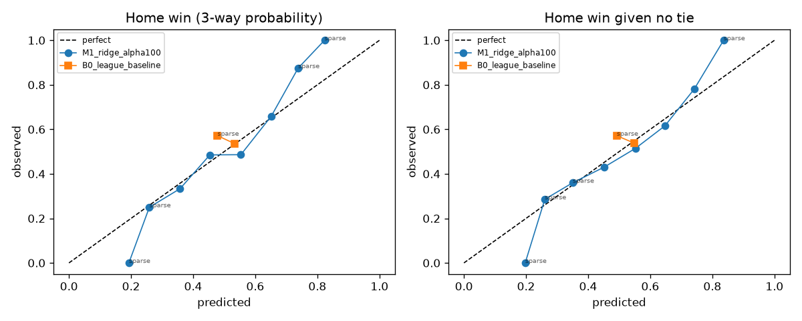
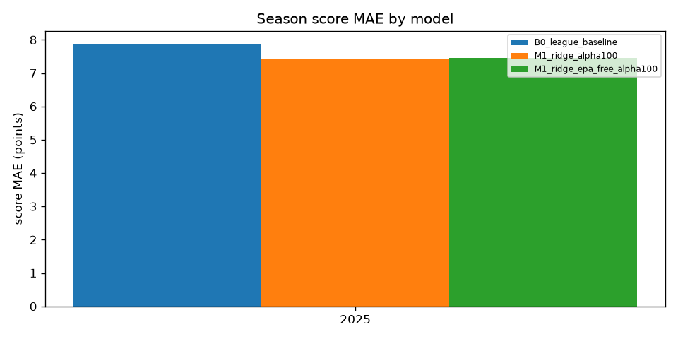
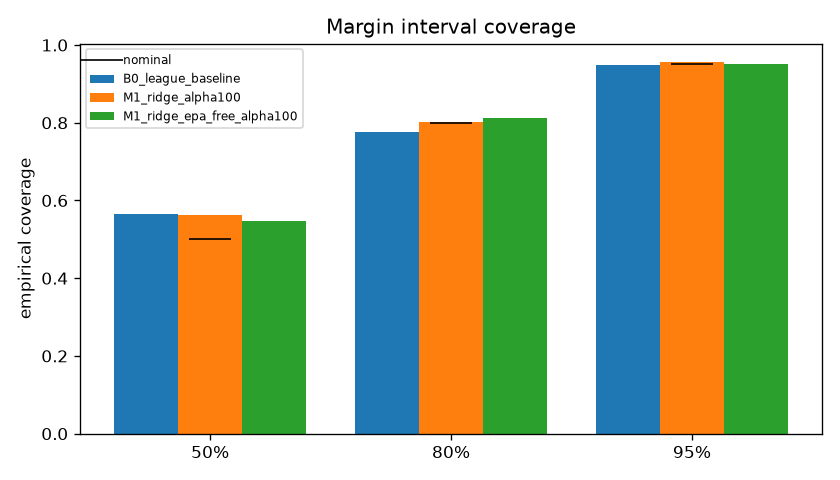
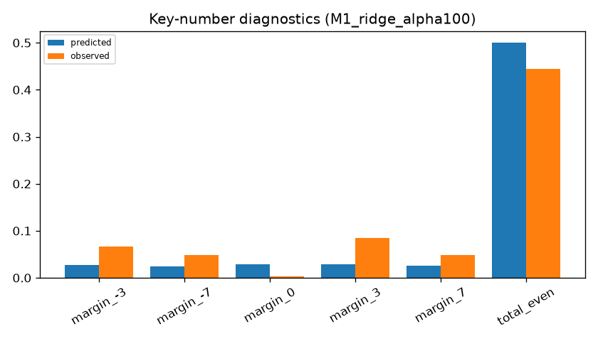
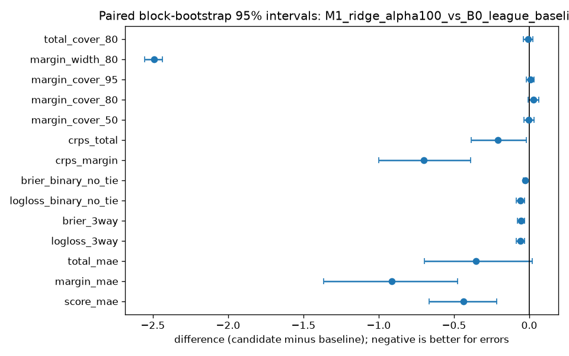

# NFL Origination Model — holdout run `holdout-20260916T175029Z-4385c4`

Created 2026-09-16T17:50:32.970009Z · data mode `historical_reconstruction` · forecast policy `kickoff_minus_24h` · git `518434a9d3a2e56d284c8a8bc701b181e3da819d` (dirty) · config hash `118cd4d8a367`

Scored seasons: [2025] · primary model `M1_ridge_alpha100` · baseline `B0_league_baseline`

## Methodology

Expanding chronological fits (train on 2012…Y−1, freeze for season Y), residual mean/covariance from the five most recent out-of-fold seasons, rounded bivariate-normal score PMF, fair prices from the PMF. Each game's cutoff is kickoff minus 24 hours; source games need kickoff + 48h ≤ cutoff.

## Samples and exclusions

| season | scheduled | expected | final | with PBP | excluded | complete |
|---|---|---|---|---|---|---|
| 2010 | 256 | 256 | 256 | 256 | 0 | True |
| 2011 | 256 | 256 | 256 | 256 | 0 | True |
| 2012 | 256 | 256 | 256 | 256 | 0 | True |
| 2013 | 256 | 256 | 256 | 256 | 0 | True |
| 2014 | 256 | 256 | 256 | 256 | 0 | True |
| 2015 | 256 | 256 | 256 | 256 | 0 | True |
| 2016 | 256 | 256 | 256 | 256 | 0 | True |
| 2017 | 256 | 256 | 256 | 256 | 0 | True |
| 2018 | 256 | 256 | 256 | 256 | 0 | True |
| 2019 | 256 | 256 | 256 | 256 | 0 | True |
| 2020 | 256 | 256 | 256 | 256 | 0 | True |
| 2021 | 272 | 272 | 272 | 272 | 0 | True |
| 2022 | 271 | 272 | 271 | 271 | 0 | False |
| 2023 | 272 | 272 | 272 | 272 | 0 | True |
| 2024 | 272 | 272 | 272 | 272 | 0 | True |
| 2025 | 272 | 272 | 272 | 272 | 0 | True |

Notes: season 2022: 271 scheduled games, expected 272

Exclusion rows: 0 (see exclusions.csv).

## Pooled metrics

| metric | B0_league_baseline | M1_ridge_alpha100 | M1_ridge_epa_free_alpha100 |
|---|---|---|---|
| Score MAE (team-game) | 7.8768 | 7.4388 | 7.4637 |
| Score RMSE | 9.8795 | 9.3435 | 9.3508 |
| Margin MAE | 11.0642 | 10.1495 | 10.1909 |
| Margin RMSE | 14.1458 | 12.9797 | 13.0008 |
| Total MAE | 10.9711 | 10.6156 | 10.6497 |
| Total RMSE | 13.7954 | 13.4436 | 13.4437 |
| 3-way log loss | 0.7295 | 0.6706 | 0.6704 |
| 3-way Brier (sum over classes) | 0.5020 | 0.4478 | 0.4472 |
| Binary log loss (non-tied) | 0.6906 | 0.6314 | 0.6310 |
| Binary Brier (non-tied) | 0.2488 | 0.2213 | 0.2210 |
| CRPS margin | 7.9870 | 7.2874 | 7.3084 |
| CRPS total | 7.7965 | 7.5893 | 7.5879 |
| Margin 50% coverage | 0.5662 | 0.5625 | 0.5478 |
| Margin 80% coverage | 0.7757 | 0.8015 | 0.8125 |
| Margin 95% coverage | 0.9485 | 0.9559 | 0.9522 |
| Margin 80% mean width | 36.0000 | 33.5074 | 33.6507 |
| Total 80% coverage | 0.8125 | 0.8051 | 0.8051 |
| Predicted tie rate | 0.0280 | 0.0282 | 0.0284 |
| Observed tie rate | 0.0037 | 0.0037 | 0.0037 |
| Games | 272.0000 | 272.0000 | 272.0000 |

## Paired differences vs baseline (block bootstrap 95% intervals)


**M1_ridge_alpha100_vs_B0_league_baseline**

| metric | candidate | baseline | difference | ci low | ci high | games |
|---|---|---|---|---|---|---|
| brier_3way | 0.4478 | 0.5020 | -0.0542 | -0.0792 | -0.0299 | 272 |
| brier_binary_no_tie | 0.2213 | 0.2488 | -0.0274 | -0.0403 | -0.0148 | 272 |
| crps_margin | 7.2874 | 7.9870 | -0.6996 | -1.0011 | -0.3903 | 272 |
| crps_total | 7.5893 | 7.7965 | -0.2072 | -0.3874 | -0.0183 | 272 |
| logloss_3way | 0.6706 | 0.7295 | -0.0589 | -0.0861 | -0.0321 | 272 |
| logloss_binary_no_tie | 0.6314 | 0.6906 | -0.0593 | -0.0863 | -0.0326 | 272 |
| margin_cover_50 | 0.5625 | 0.5662 | -0.0037 | -0.0370 | 0.0325 | 272 |
| margin_cover_80 | 0.8015 | 0.7757 | 0.0257 | -0.0074 | 0.0620 | 272 |
| margin_cover_95 | 0.9559 | 0.9485 | 0.0074 | -0.0181 | 0.0320 | 272 |
| margin_mae | 10.1495 | 11.0642 | -0.9147 | -1.3670 | -0.4744 | 272 |
| margin_width_80 | 33.5074 | 36.0000 | -2.4926 | -2.5540 | -2.4348 | 272 |
| score_mae | 7.4388 | 7.8768 | -0.4380 | -0.6660 | -0.2183 | 272 |
| total_cover_80 | 0.8051 | 0.8125 | -0.0074 | -0.0381 | 0.0225 | 272 |
| total_mae | 10.6156 | 10.9711 | -0.3555 | -0.6951 | 0.0177 | 272 |

**M1_ridge_epa_free_alpha100_vs_B0_league_baseline**

| metric | candidate | baseline | difference | ci low | ci high | games |
|---|---|---|---|---|---|---|
| brier_3way | 0.4472 | 0.5020 | -0.0548 | -0.0779 | -0.0313 | 272 |
| brier_binary_no_tie | 0.2210 | 0.2488 | -0.0278 | -0.0397 | -0.0158 | 272 |
| crps_margin | 7.3084 | 7.9870 | -0.6786 | -0.9752 | -0.3915 | 272 |
| crps_total | 7.5879 | 7.7965 | -0.2087 | -0.4091 | -0.0120 | 272 |
| logloss_3way | 0.6704 | 0.7295 | -0.0591 | -0.0845 | -0.0347 | 272 |
| logloss_binary_no_tie | 0.6310 | 0.6906 | -0.0596 | -0.0850 | -0.0349 | 272 |
| margin_cover_50 | 0.5478 | 0.5662 | -0.0184 | -0.0538 | 0.0147 | 272 |
| margin_cover_80 | 0.8125 | 0.7757 | 0.0368 | 0.0036 | 0.0699 | 272 |
| margin_cover_95 | 0.9522 | 0.9485 | 0.0037 | -0.0227 | 0.0294 | 272 |
| margin_mae | 10.1909 | 11.0642 | -0.8733 | -1.2849 | -0.4759 | 272 |
| margin_width_80 | 33.6507 | 36.0000 | -2.3493 | -2.3881 | -2.3082 | 272 |
| score_mae | 7.4637 | 7.8768 | -0.4131 | -0.6046 | -0.2163 | 272 |
| total_cover_80 | 0.8051 | 0.8125 | -0.0074 | -0.0366 | 0.0229 | 272 |
| total_mae | 10.6497 | 10.9711 | -0.3214 | -0.6699 | 0.0545 | 272 |

## Season and slice results (primary model)

| slice | games | score MAE | margin MAE | total MAE | 3-way log loss | CRPS margin | 80% cover |
|---|---|---|---|---|---|---|---|
| early_weeks_1_4 | 64.0000 | 7.1603 | 9.3001 | 11.2086 | 0.6735 | 6.9573 | 0.8125 |
| neutral_site | 7.0000 | 6.6437 | 6.8771 | 8.6141 | 0.5538 | 5.6037 | 0.8571 |
| season_2025 | 272.0000 | 7.4388 | 10.1495 | 10.6156 | 0.6706 | 7.2874 | 0.8015 |

## Reliability (primary model, 0.1 bins; sparse = fewer than 30 games)

| bin | n | mean predicted | observed | sparse |
|---|---|---|---|---|
| [0.0, 0.1) | 0 | n/a | n/a | True |
| [0.1, 0.2) | 1 | 0.1930 | 0.0000 | True |
| [0.2, 0.3) | 16 | 0.2590 | 0.2500 | True |
| [0.3, 0.4) | 33 | 0.3578 | 0.3333 | False |
| [0.4, 0.5) | 68 | 0.4539 | 0.4853 | False |
| [0.5, 0.6) | 72 | 0.5536 | 0.4861 | False |
| [0.6, 0.7) | 47 | 0.6518 | 0.6596 | False |
| [0.7, 0.8) | 24 | 0.7381 | 0.8750 | True |
| [0.8, 0.9) | 11 | 0.8230 | 1.0000 | True |
| [0.9, 1.0] | 0 | n/a | n/a | True |

## Key-number diagnostics (primary model)

| event | predicted | observed |
|---|---|---|
| margin_-3 | 0.0269 | 0.0662 |
| margin_-7 | 0.0236 | 0.0478 |
| margin_0 | 0.0282 | 0.0037 |
| margin_3 | 0.0281 | 0.0846 |
| margin_7 | 0.0263 | 0.0478 |
| total_even | 0.5001 | 0.4449 |

## Recommendation

M1_ridge_alpha100 improves on B0_league_baseline with bootstrap intervals excluding zero on score_mae, logloss_3way, crps_margin, crps_total. Recommend the candidate as the V1 origination model, with the stated limitations. Further modeling is still needed before any real pregame use.

## Charts







## Market comparison and paper backtest

unavailable: no eligible timestamped odds

## Limitations

- Historical reconstruction uses current pinned nflverse files with a 48-hour eligibility convention; it is not a point-in-time-certified backtest. Upstream EPA values may have been revised or computed with models trained later (see the EPA-free ablation).
- No injuries, projected starters, weather, or depth charts are used. This limits real pregame usefulness and is disclosed rather than hidden.
- Scores come from a rounded, zero-floored bivariate normal. It permits implausible scores and smooths NFL key numbers (3, 7) and total parity; key-number diagnostics expose this.
- The 2025 holdout is a retrospective project holdout, not proof of no prior knowledge of its outcomes.
- Bookmaker lines are price references, not conditional means. A model-market gap is not proof of mispricing, and no positive ROI is claimed.

## Provenance

```json
{
 "run_id": "holdout-20260916T175029Z-4385c4",
 "config_hash": "118cd4d8a367e4ccaa0780d8d1e5399b4ff2bc5f5965d8214e794a86cec36629",
 "source_file_hashes": {
  "pbp/2010": "d2ef9c407319719910ad8de8c4c1b88f0ea945ffb3f78f48ef32fa3ed3a7573b",
  "pbp/2011": "c54753b8137b88dab260489b1462cbf1309c3d11741eb8d10e5f1b0a9b8795b1",
  "pbp/2012": "447b90789104aac70427ec9d3b51df7247234029d0ecabd269279369b1cc6278",
  "pbp/2013": "f454605a1983b3946baf0ffadf3a0b9f5e04735c4b84732e0483f2049a780d00",
  "pbp/2014": "54c01408d8f0ff9e013a4ea51428b91d610101f72545d082e932f5710e2fb4f7",
  "pbp/2015": "01b5ae7d06633a2e66b418404461a3d4ff055ad2f3a87d453cebcc8d3fda7ed9",
  "pbp/2016": "95eba04e2145e3c1c8ca502f2a3a76cfb0a5990680c3fb480f02a74a45f54a3b",
  "pbp/2017": "84eacd963c1fdd45965f6222c62e9329a7f3412f029d92c1ac5e34a1bb4d3710",
  "pbp/2018": "2e6f2dce7c7ebd46e985cabe0c17eb72b39a77f98cb4478409294f50b5820150",
  "pbp/2019": "60c3067017db2d28a78f66a79b657268be8578d9a5288e6a827efdcd7fe42540",
  "pbp/2020": "8889f5d8782b5c5dce3c3644acdc0322b228a7e9cb13fa36cbac250e260e9f60",
  "pbp/2021": "333ad34378e5339d5172717cc83378e908daf02c8699416ab3e17c2ec10f78d8",
  "pbp/2022": "931121d8897779d7944e2a293e92ed8799c8e5cceef84096ac42339003fedc09",
  "pbp/2023": "bd3484731408def6b0ec93225bba2bd7b2c65769ca707a2b9444d891abdc6776",
  "pbp/2024": "3fd2896bc0b911b615142d2f1fabae54a4bbba5ab7b73b28187b118ef8af6a3b",
  "pbp/2025": "c6ecedd6d678cc37ed316b23ef84ee1ec6abb69c514bb11868a7ebd5a367df29",
  "schedules/all": "fa6684321ed9d08ee7496dfa9a4d345e9445cba7e8842c42f383ad524dc442d0"
 },
 "output_hashes": {
  "metrics.json": "05bb22b7ce89c3895fdc972ddd163e8249fe2ae715c023f51f880257363176b0",
  "predictions.parquet": "8966861db081a90e84e4e339227fd3331ac523abff2db92b7868ca7e7a0b88d9",
  "predictions_B0_league_baseline.parquet": "ecd582acff6c110ca40c4dc7810db370ef9d46c74570ffcbf92453f34e64684b",
  "predictions_M1_ridge_alpha100.parquet": "8966861db081a90e84e4e339227fd3331ac523abff2db92b7868ca7e7a0b88d9",
  "predictions_M1_ridge_epa_free_alpha100.parquet": "23024ecca21b20ceb61a0dc3750ab1acdabc8c362aa163061a72a19716fce18a"
 },
 "dependency_versions": {
  "duckdb": "1.5.5",
  "matplotlib": "3.11.2",
  "nfl_origination": "0.1.0",
  "numpy": "2.5.3",
  "pandas": "3.0.5",
  "pyarrow": "25.0.1",
  "pydantic": "2.13.5",
  "python": "3.12.14",
  "scikit-learn": "1.9.1",
  "scipy": "1.18.1",
  "streamlit": "1.64.0",
  "typer": "0.27.2"
 },
 "notes": []
}
```
